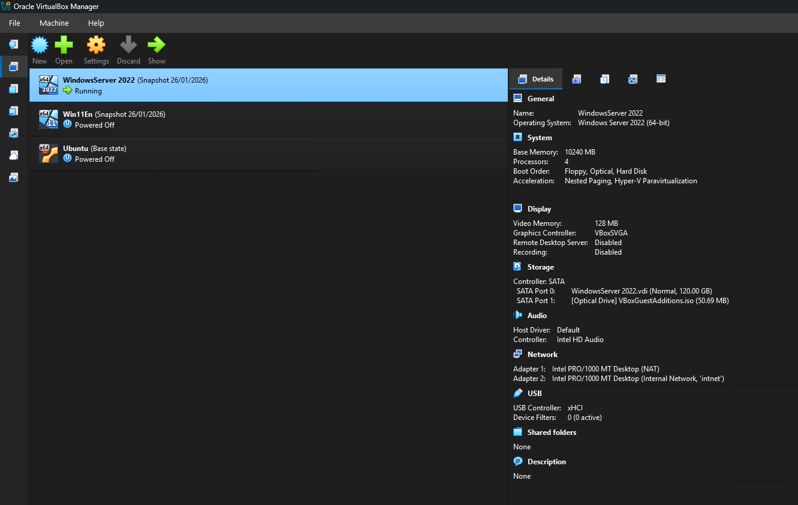
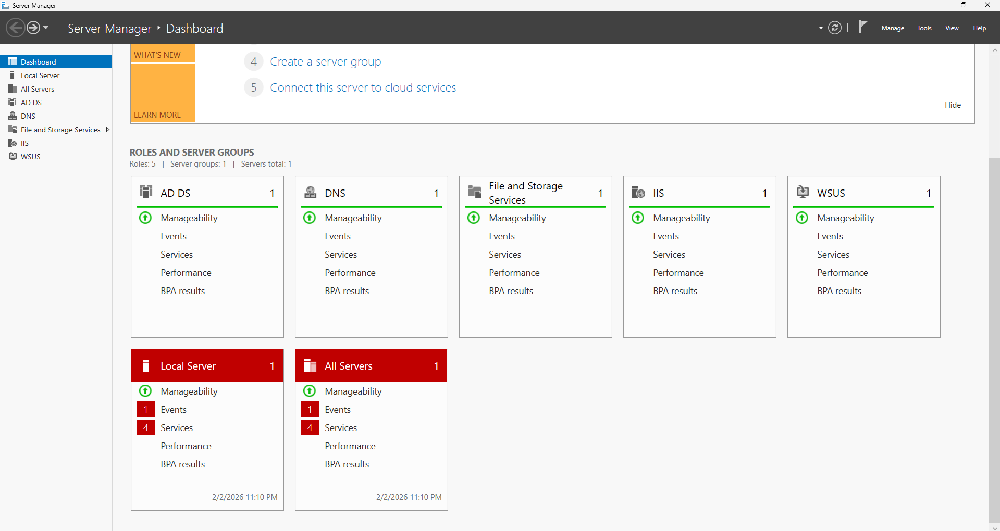
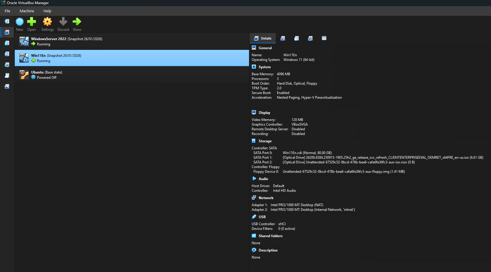
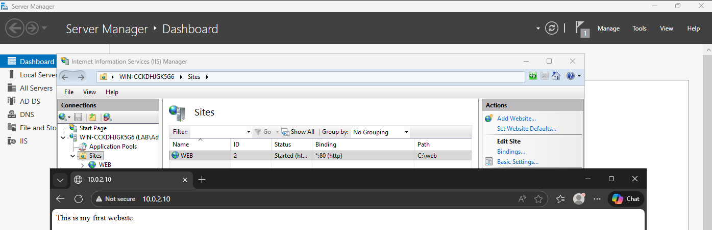
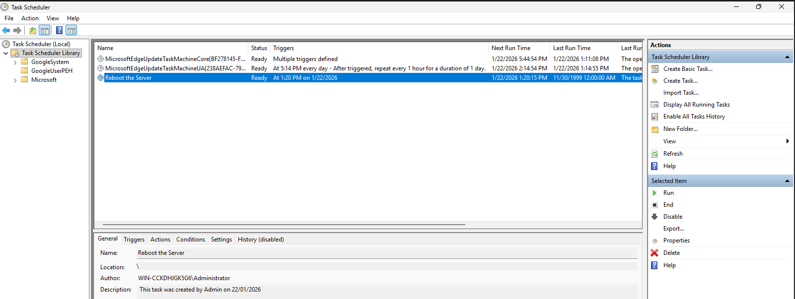
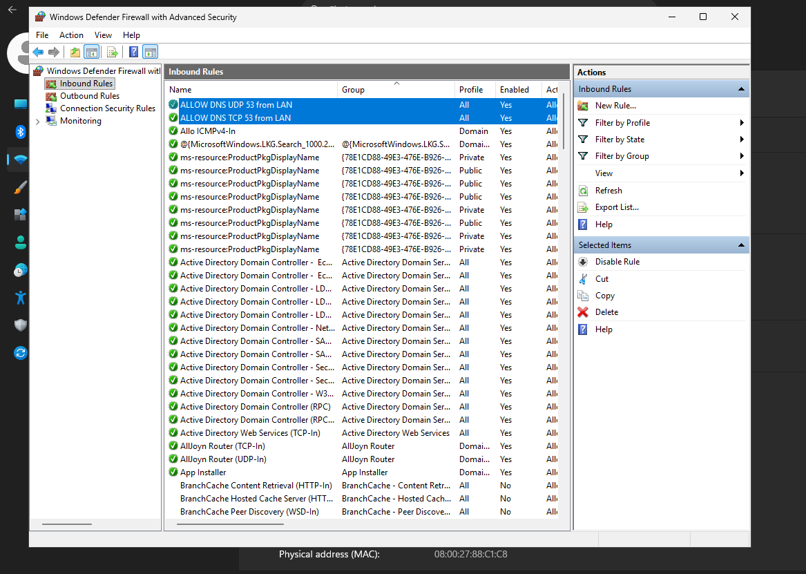
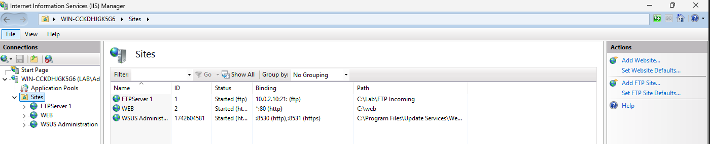
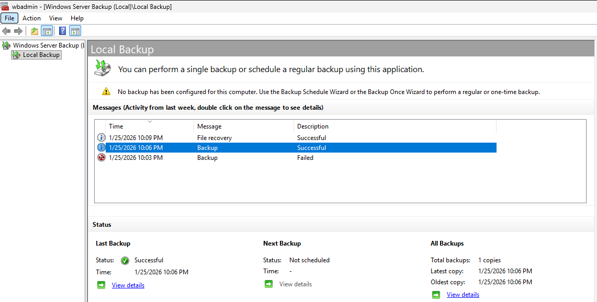

# Windows Server Administration Lab (Domain Services & Core Administration)

This lab documents hands-on Windows Server administration tasks completed as part of the  
**“A Complete Course on Windows Server Administration”** (Packt / Coursera).

The purpose of this lab is to demonstrate undestanding of **core IT fundamentals** and demonstrate hands-on experience in Windows administration, including Active Directory, domain services, system hardening, and
administrative automation.

---

## Lab Environment

**Hypervisor**
- Oracle VirtualBox 7.2.4

**Virtual Machines**
- VM1: Windows Server 2022 (Domain Controller)
- VM2: Windows 11 Enterprise (Domain Member)

**Network**
- Static IP assigned to Domain Controller
- Internal network for domain communication

---

## Objectives

This lab demonstrates the ability to:

1. Deploy and manage virtual machines;
2. Perform basic VM resource management;
3. Administer Windows Server 2022, including:
   - Active Directory Domain Services;
   - User and group management;
   - Task scheduling;
   - Firewall configuration;
   - Update policies;
   - Backup configuration.

---

## Lab Tasks and Implementation

### 1. Windows Server 2022 Deployment
- Installed Windows Server 2022 on Oracle VirtualBox;
- Configured the server with a **static IP address**;
- Prepared the host to operate as a **Domain Controller**.

---

### 2. Active Directory & Domain Controller Setup
- Installed **Active Directory Domain Services (AD DS)**;
- Promoted the server to a **Domain Controller**;
- Created a new domain.

---

### 3. Users and Groups Management
- Created domain users;
- Created security groups;
- Assigned users to appropriate groups.

---

### 4. Windows 11 Domain Join
- Deployed Windows 11 Enterprise VM;
- Joined the workstation to the domain;
- Verified authentication against the Domain Controller.

---

### 5. Website Deployment (IIS)
- Created a blank website using built-in Windows Server tools;
- Verified accessibility.

---

### 6. Scheduled Task Configuration
- Created a **scheduled reboot task** for the host

---

### 7. Firewall Configuration
- Added Windows Defender Firewall rules;
- Allowed **DNS traffic** between Domain Controller and domain host.

---

### 8. FTP Server Setup
- Installed and configured an FTP server;
- Verified basic functionality.

---

### 9. Domain Update Policy
- Configured update policies for domain-joined systems

---

### 10. Backup Configuration
- Created a scheduled backup task

---

## Tools Used

- Oracle VirtualBox;
- Windows Server 2022;
- Windows 11 Enterprise;
- Active Directory Domain Services;
- Windows Defender Firewall;
- Task Scheduler;
- Group Policy.

---

## Key Skills Demonstrated

- Windows Server administration fundamentals;
- Active Directory setup and management;
- Domain-based identity management;
- Host-based firewall configuration;
- Administrative task automation;
- Infrastructure awareness relevant to SOC operations.

---

## Learning Outcomes

- Gained practical experience managing Windows Server infrastructure;
- Developed understanding of how enterprise identity systems operate;
- Built foundational knowledge required for security monitoring and incident response roles.

---

## Disclaimer

All systems used in this lab are **non-production**, **simulated**, and **isolated**.
No real user data, credentials, or sensitive information were used.
