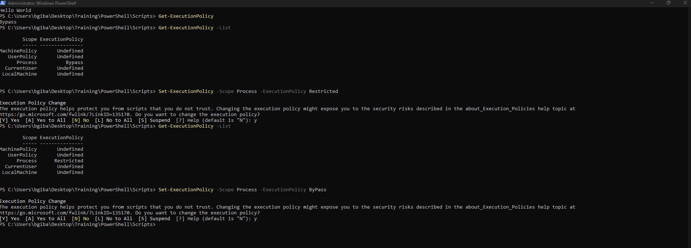
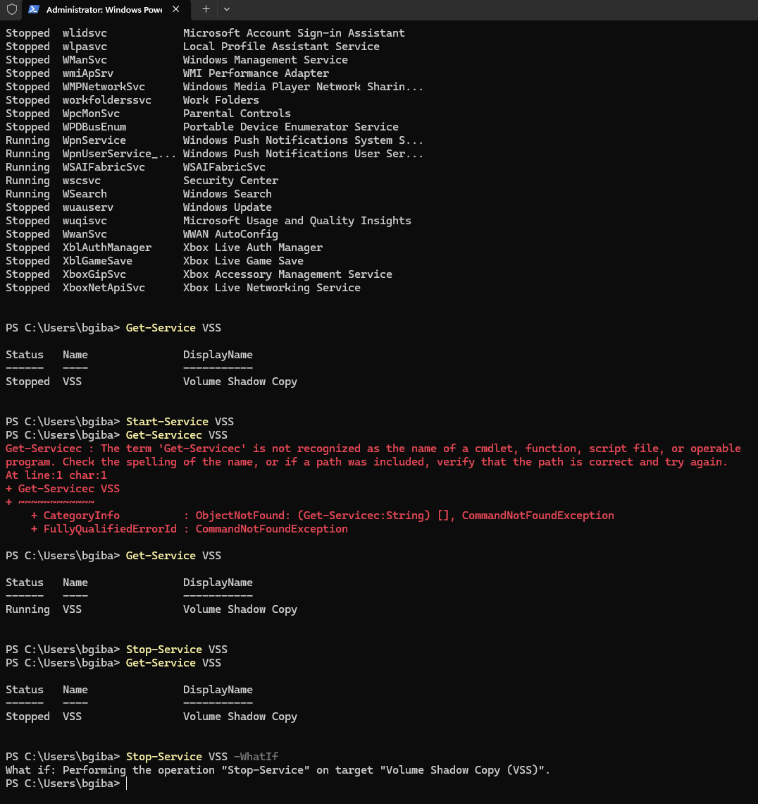
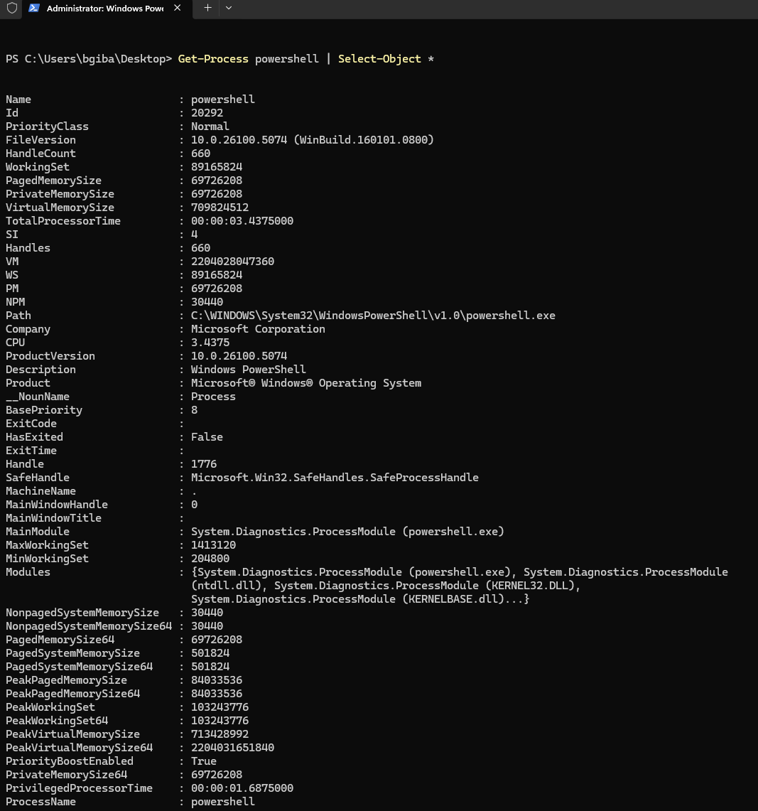
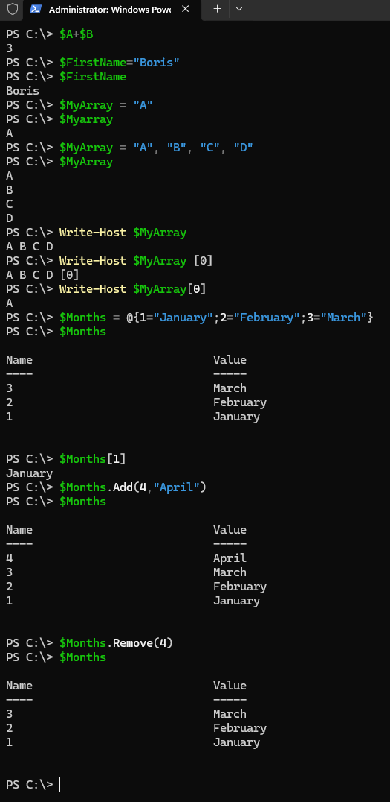
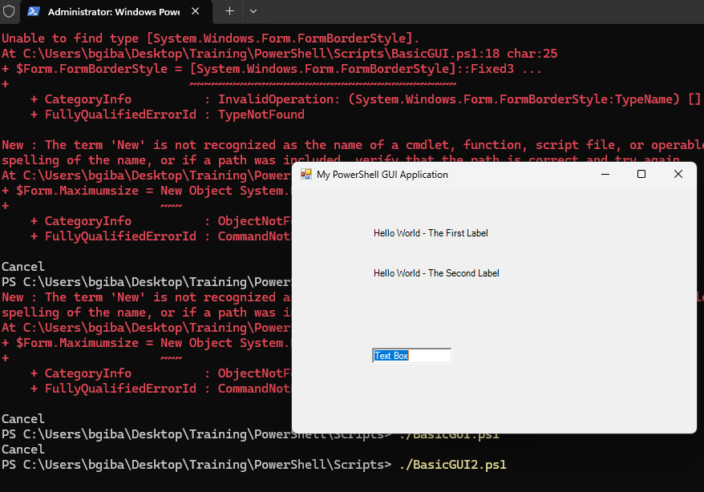

# PowerShell Scripting Lab (Windows Administration Fundamentals)

This lab documents hands-on PowerShell scripting and command-line administration
completed as part of the **“Practical Windows PowerShell Scripting”** specialization
(Pearson / Coursera).

The goal of this lab is to demonstrate **foundational scripting skills** that are
directly relevant to system administration and entry-level cybersecurity roles.

---

## Lab Environment

**Operating System**
- Windows 11

**Shell**
- Windows PowerShell

---

## Objectives

This lab demonstrates the ability to:

1. Configure PowerShell execution policy
2. Manage Windows services via PowerShell
3. Inspect objects and properties
4. Work with variables and arrays
5. Create simple PowerShell scripts and GUI interactions

---

## Lab Tasks and Implementation

### 1. Execution Policy Configuration

- Modified PowerShell execution policy to **Bypass**;
- Enabled execution of locally created scripts.

---

### 2. Windows Services Management

Used the following cmdlets to manage services:
- `Get-Service`
- `Start-Service`
- `Stop-Service`

Validated service state changes directly from PowerShell.

---

### 3. Object Inspection with Select-Object

- Executed `Select-Object *` to retrieve full object properties
- Explored detailed metadata returned by PowerShell cmdlets

---

### 4. Variables and Arrays

- Defined scalar variables
- Performed operations using variables
- Created and manipulated arrays

---

### 5. Script Creation and GUI Pop-Up

- Created a PowerShell script using **Notepad**
- Implemented a simple **GUI pop-up message**

---

## Tools and Cmdlets Used

- Windows PowerShell
- Get-Service / Start-Service / Stop-Service
- Select-Object
- Variables and arrays
- Basic PowerShell scripting
- GUI message box creation

---

## Key Skills Demonstrated

- PowerShell fundamentals
- Script execution control
- Service management via CLI
- Object-oriented shell concepts
- Basic automation and scripting logic

---

## Disclaimer

All scripts and commands were executed in a **non-production test environment**.
No real systems, credentials, or sensitive data were used.
