# Lab 03 — Linux Fundamentals (Ubuntu Administration) 🐧

**Platform:** Ubuntu (Oracle VirtualBox)  
**Focus:** Core Linux system administration, user management, networking, and monitoring  

---

## Lab Summary

This lab demonstrates hands-on experience with **Linux system administration** using Ubuntu.

The work includes:

- User and group management  
- File permissions and access control  
- Process and service monitoring  
- Network configuration and diagnostics  
- Task scheduling and automation  
- Deployment of monitoring and web services  

---

## Objective

The goal of this lab is to:

- Build foundational Linux administration skills  
- Understand system-level operations and services  
- Perform basic system hardening and monitoring tasks  
- Support security operations through system visibility and control  

---

## Lab Environment

- Ubuntu Linux (VirtualBox VM)  
- CLI-based administration  
- Network utilities and monitoring tools  
- Apache, Nagios, and Cockpit services  

All work was performed in an **isolated lab environment**.

---

# Part 1 — System Setup

## 1.1 Ubuntu Installation

Deployed Ubuntu VM in Oracle VirtualBox.

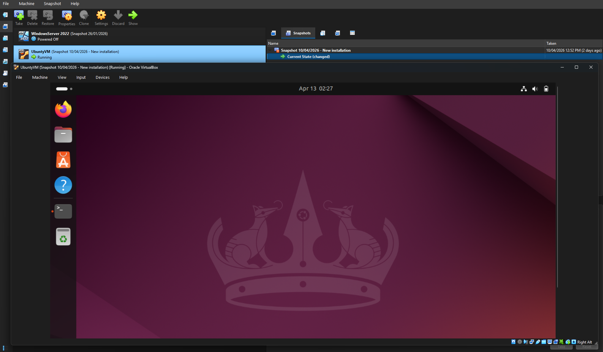

---

## 1.2 Package Installation

Installed packages:

- OpenSSH Server  
- net-tools
- other relevant packages were installed in due corse

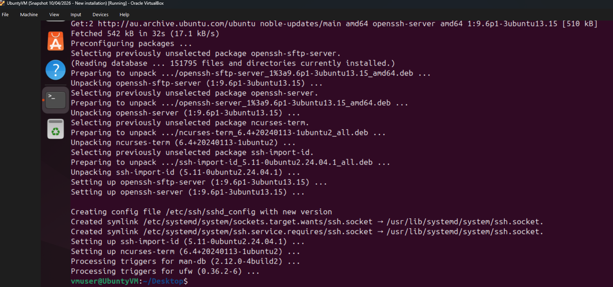

---

# Part 2 — User & Access Management

## 2.1 User Creation

Created system users for administration and testing.

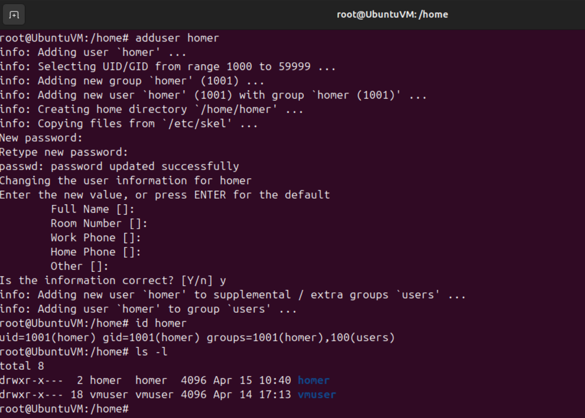

---

## 2.2 Group Management

Created custom group and assigned users.

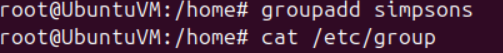

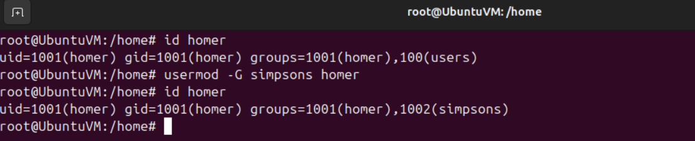

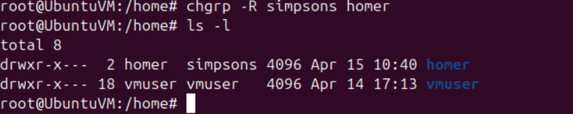

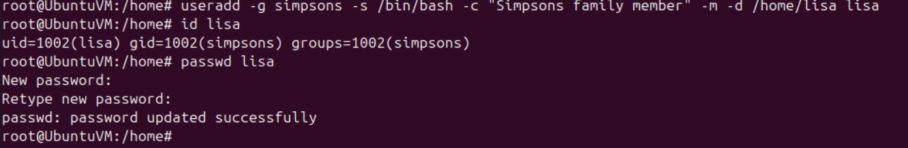

---

## 2.3 Password Policies

Adjusted password settings for new users.

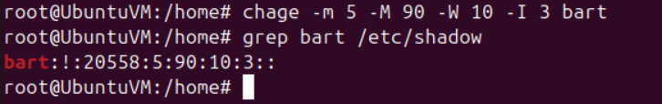

---

# Part 3 — System Monitoring

## 3.1 Logged-in Users

Checked active user sessions.

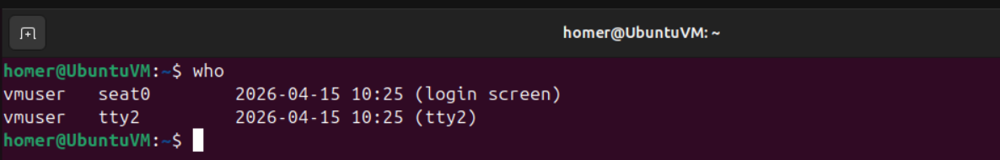

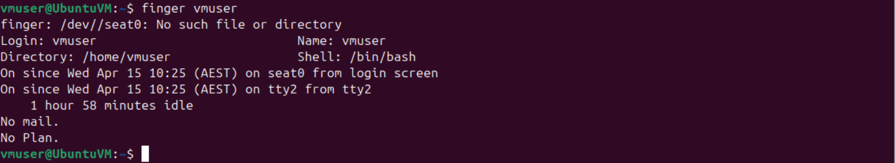

---

## 3.2 Service Status

Verified status of system services (e.g., NetworkManager).

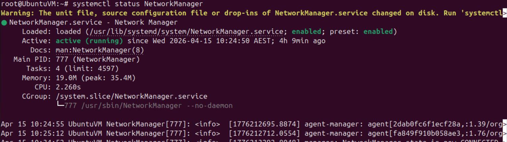

---

## 3.3 Process Monitoring

Listed running processes.

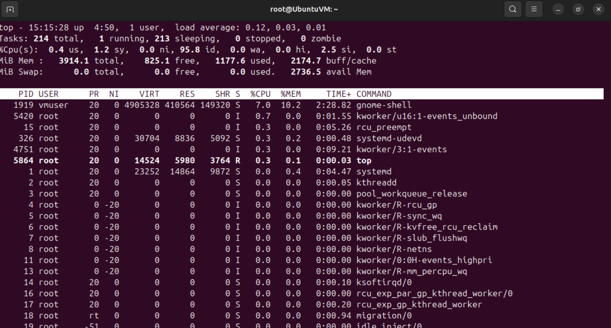

---

## 3.4 Disk Usage

Checked disk partitions and usage.

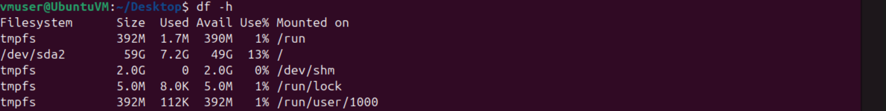

---

# Part 4 — Networking

## 4.1 Network Connections

Inspected active network connections.

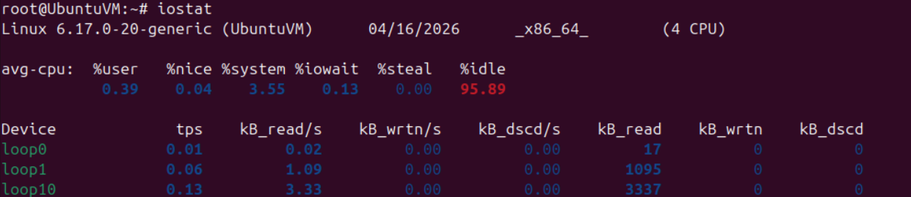

---

## 4.2 System Information

Retrieved system and hardware details.

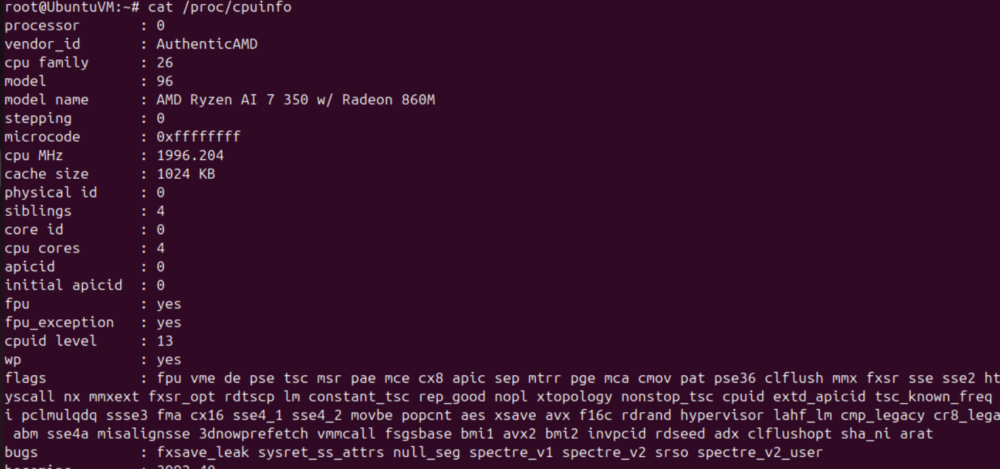

---

## 4.3 Hostname Configuration

Changed system hostname.

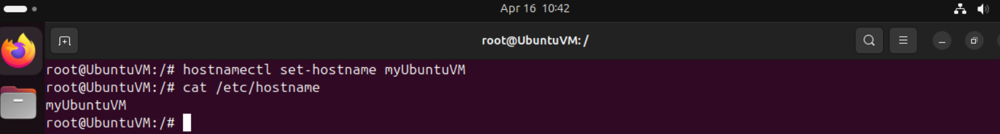

---

## 4.4 NIC Bonding

Configured network interface bonding via NetworkManager UI.

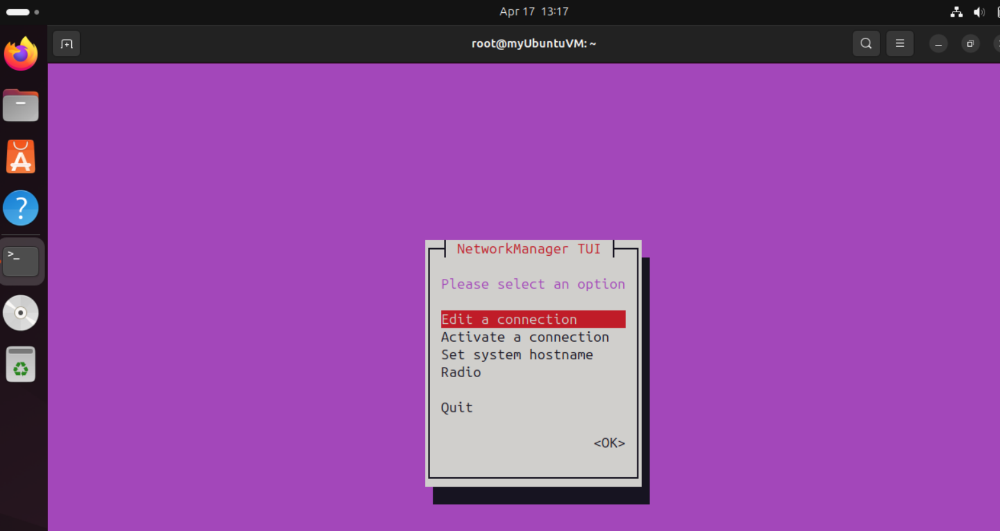

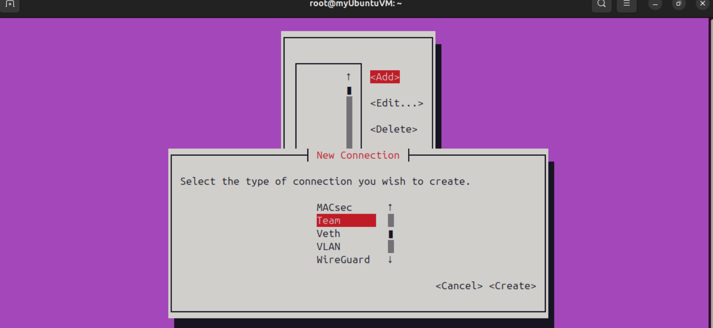

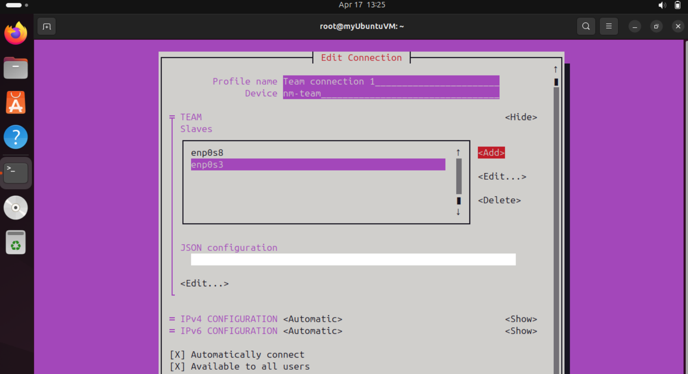

---

# Part 5 — Automation & Scheduling

## 5.1 Scheduled Tasks

Created cron job for task automation.

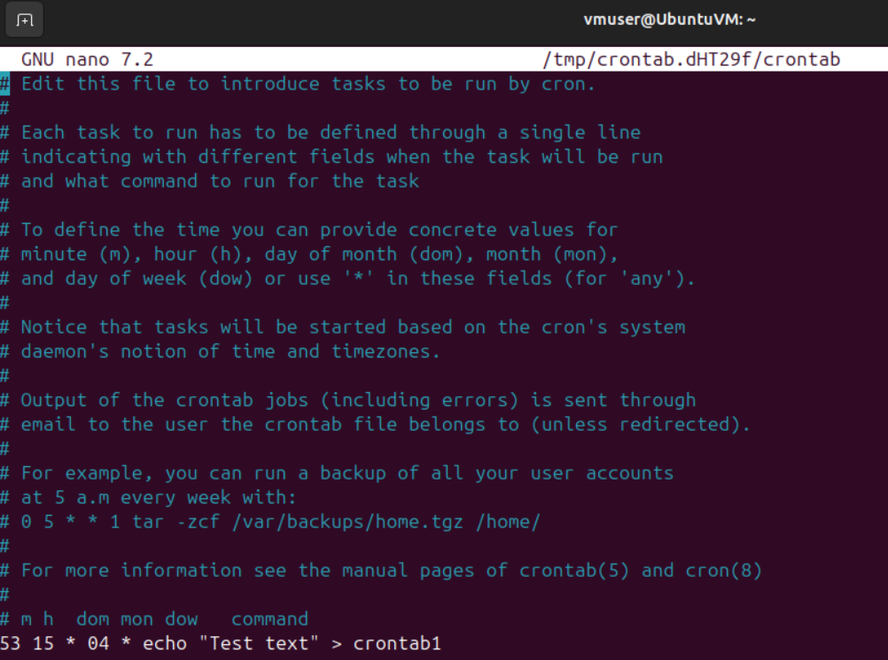

---

## 5.2 Script Execution

Tested scripts:

- System information script  
- Network reachability (ping) script  

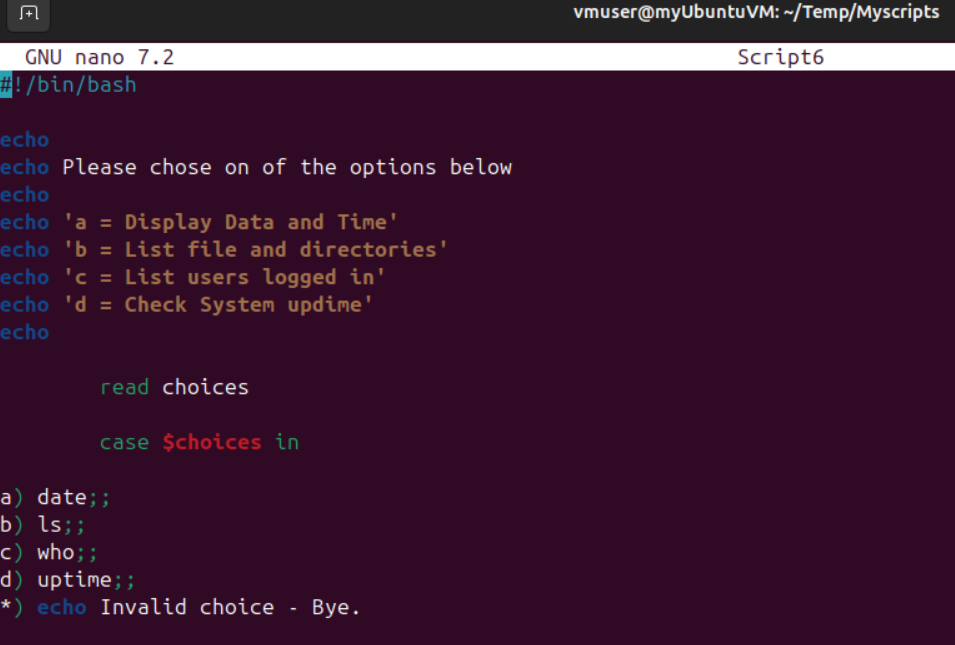

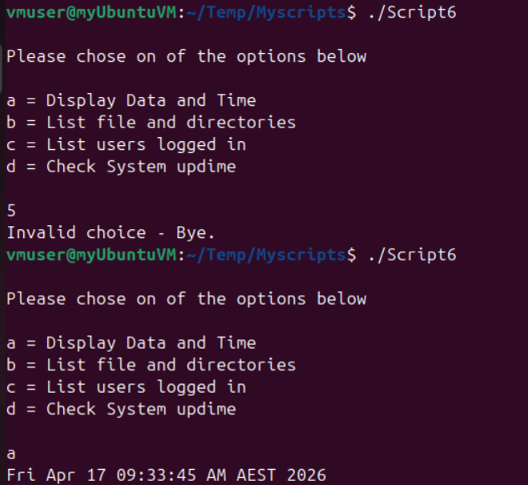

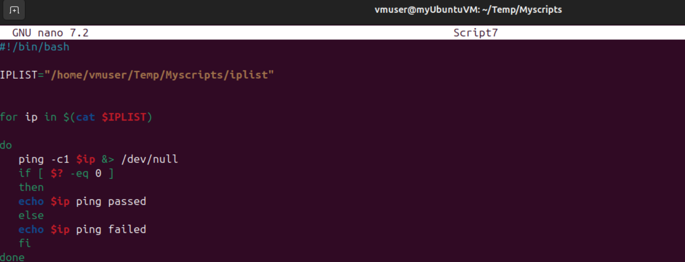

---

# Part 6 — Service Deployment

## 6.1 Apache Web Server

Installed and verified Apache deployment.

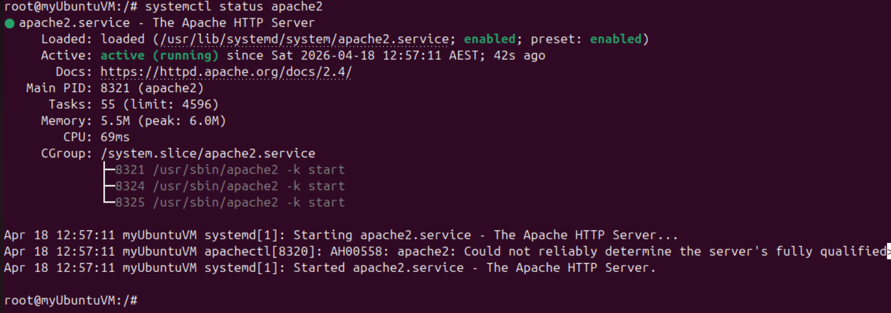

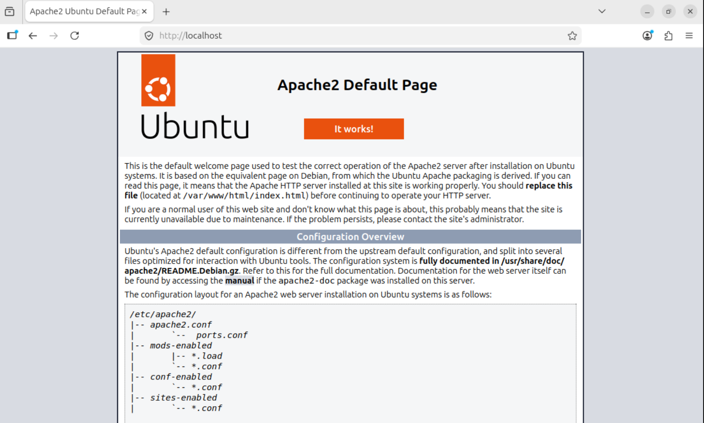

---

## 6.2 Cockpit Administration Tool

Installed Cockpit for web-based system management.

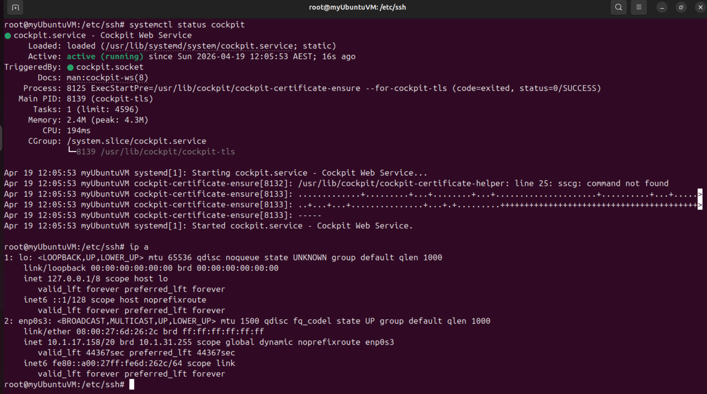

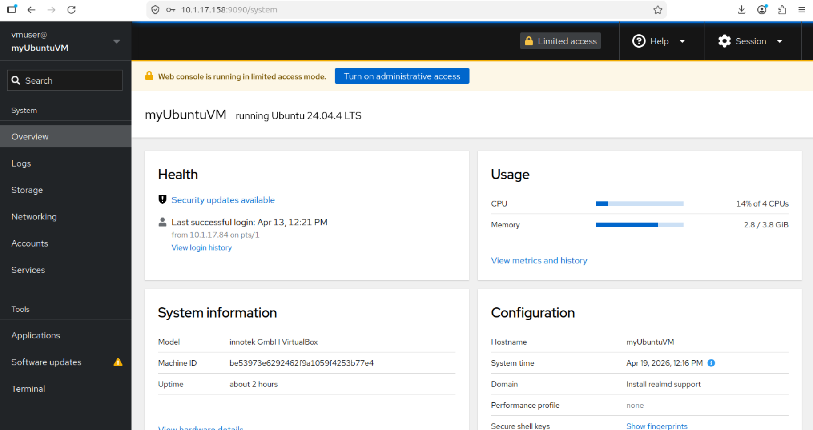

---

# Skills Demonstrated

- Linux system administration  
- User and group management  
- File permissions and access control  
- Process and service monitoring  
- Network troubleshooting  
- Task automation (cron, scripts)  
- Web server deployment (Apache)  
- Monitoring tools (Cockpit)  

---

## Investigation Value (SOC Context)

This lab supports:

- Log analysis and system monitoring  
- Detection of abnormal processes and user activity  
- Network visibility and troubleshooting  
- Understanding Linux-based attack surfaces  

---

## Disclaimer

All work performed in a **non-production lab environment using simulated data**.
